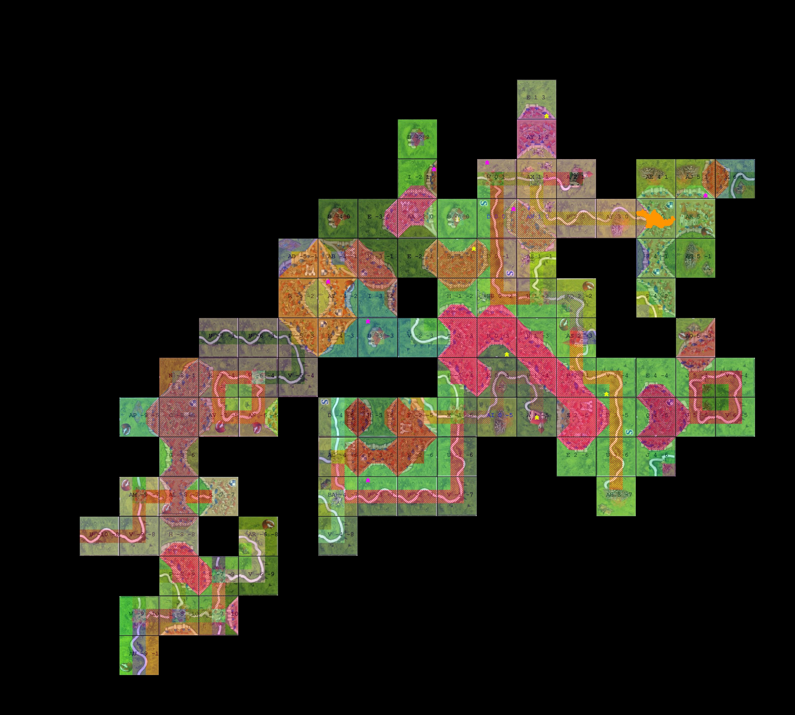

# Projet Carcassonne

## Instructions pour le lancement du jeu Carcassonne

### 1. Installer Maven

Si maven est déjà installé sur votre machine, il n'est pas nécessaire de faire cette étape. Passez à la suivante (étape deux)!

Cette étape consiste à installer [Maven](https://maven.apache.org/download.cgi#Files) qui est un outil de gestion et de
compréhension de projet.
> [Télécharger maven ici](https://maven.apache.org/download.cgi#Files)

1. Choisissez un endroit que vous n'allez pas supprimer. Ici nous utiliserons ce chemin "C:\Program Files\"
2. Créer un dossier dans le chemin que vous avez choisi et nommez-le 'Maven' "C:\Program Files\Maven\"
3. Créer un dossier dans le dossier Maven et nommez-le en fonction de la version utilisée, ici 3.8.2 "C:\Program
   Files\Maven\3.8.2\"
4. Ouvrer le zip "apache-maven-<version>-bin.zip" et glissez le contenu dans "C:\Program Files\Maven\3.8.2\"
5. Télécharger Maven de la colonne "Link", ligne "Binary zip archive". Le nom du fichier doit être sous cette forme "
   apache-maven-<version>-bin.zip"
6. Maintenant, vous avez ce chemin "C:\Program Files\Maven\3.8.2\bin\"
7. Sous Windows, cherchez dans Windows "Variables"
8. Ouvrer "Modifier les variables d'environnement système"
9. Cliquer sur "Variables d'environnement ..."
10. Dans variables système, chercher la variable 'Path'
11. Appuyer sur 'Modifier' puis sur 'Nouveau'
12. Entrer 'C:\Program Files\Maven\3.8.2\bin'
13. Valider

### 2. Construire le projet

Pour prendre en compte les nouvelles modifications du projet, il est nécessaire de construire avant de lancer le projet.

1. Pour construire le projet, executer 'Construction de carcassonne.bat'

### 3. Lancer le projet

1. Pour lancer le projet, executer le serveur 'Serveur carcassonne.bat' (Le serveur supporte plusieurs parties, les uns apres les autres).
2. Ensuite, executer 'Client carcassonne.bat' autant de fois que vous le souhaiter (entre 2 et 5). Le nombre de client doit etre specifier dans la configuration (Voir Configuration de Carcassonne)

* Le serveur ne s'arrête pas à la fin de la partie
* Les clients s'arrêtent à la fin de la partie

## Configuration de Carcassonne
Il est possible de modifier la configuration de Carcassonne dans "carcassonne-client\src\main\resources\client\config\config.txt"
````
Server
	Name	Value
	Host	127.0.0.1
	Port	8080
Logger
	Name	Value
	Level	INFO
	Player_1	35m
	Player_2	34m
	Player_3	93m
	Player_4	94m
	Player_5	95m
Match
	Name	Value
	NumMatches	10
	NumPlayers	2
Stats
	Name	Value
	CreateBoardView	True
	CreateGlobalStatistics	True
````

- **Server > Host** : L'ip du serveur
- **Server > Port** : Le port du serveur

- **Logger > Level** : Le niveau du logger (DEBUG, INFO, WARN & ERROR)
- **Logger > Player_X** : Les couleurs associées au joueur sur la console [Les codes ANSI](https://www.lihaoyi.com/post/BuildyourownCommandLinewithANSIescapecodes.html)
           
- **Match > NumMatches** : Le nombre de parties jouer
- **Match > NumPlayers** : Le nombre de joueurs dans une partie (Entre 2 et 5)

- **Stats > CreateBoardView** : Génère une image du plateau de jeu à la fin de la partie. (True ou False)
- **Stats > CreateGlobalStatistics** : Génère les statistiques de la partie. (True ou False)
## Acceder aux statistiques et aux visualisations du jeu
Pour acceder aux statistiques, il faut :
1. Aller dans le dossier "stats" qui se trouve a la racine du projet
2. Vous trouverez un dossier par client

* Les statistiques et les images sont généré à chaque fin de partie, le dossier "stats" est donc creer en meme temps.
### Game details 
game_details_X.txt contient toutes les stats d'une partie. Si vous lancez 10 parties, il y aura 10 game_details

````
Name	Player ID 1	Player ID 2
POSITION	1	2
RESULTS (score)	125	49
ROAD POINTS	0	4
TOWN POINTS	116	33
ABBEY POINTS	0	6
FIELD POINTS	9	6
PARTISANS PLAYED	7	7
PARTISANS REMAINED	0	0
````

### Game view
game_view_X.jpg contient une representation visuel d'une partie. Si vous lancez 10 parties, il y aura 10 game_view
<br>


## 500 parties
Pour faire 500 parties, il faut aller dans la configuration du jeu (Voir Configuration de Carcassonne) et modifier le nombre de parties joué
